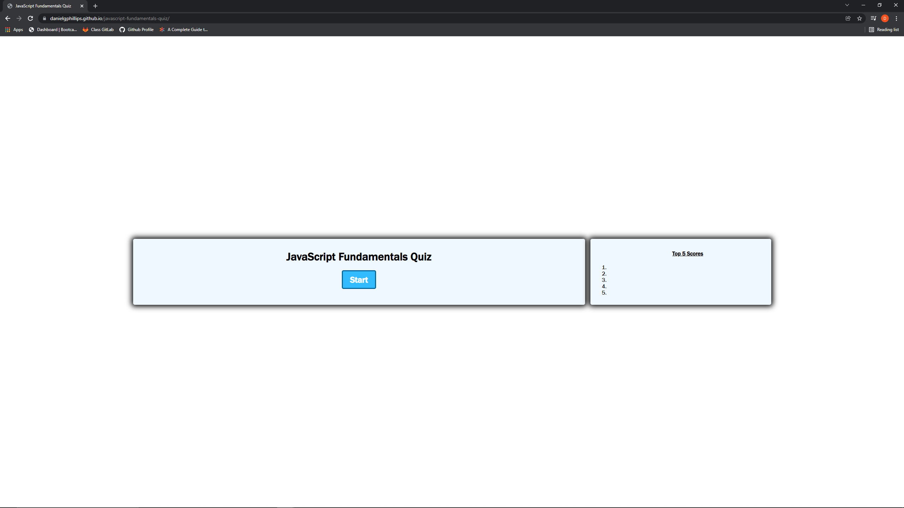
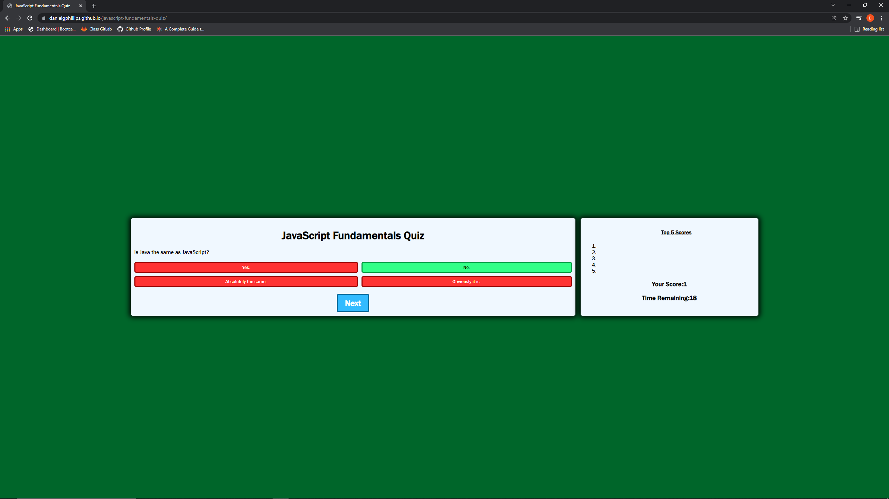

# JavaScript Fundamentals Quiz Game

## Description
A timed JavaScript quiz that stores your high score so you can measure your progress compared to your peers.  Made as part of the University of Washington Full Stack Coding Bootcamp.

## Usage
This webgame is deployed at: [https://danielgphillips.github.io/javascript-fundamentals-quiz/]

* This it the assigned acceptance criteria:
```
GIVEN I am taking a code quiz
WHEN I click the start button
THEN a timer starts and I am presented with a question
WHEN I answer a question
THEN I am presented with another question
WHEN I answer a question incorrectly
THEN time is subtracted from the clock
WHEN all questions are answered or the timer reaches 0
THEN the game is over
WHEN the game is over
THEN I can save my initials and my score
```
* The Reference 


* Screenshots of Deployed Quiz


